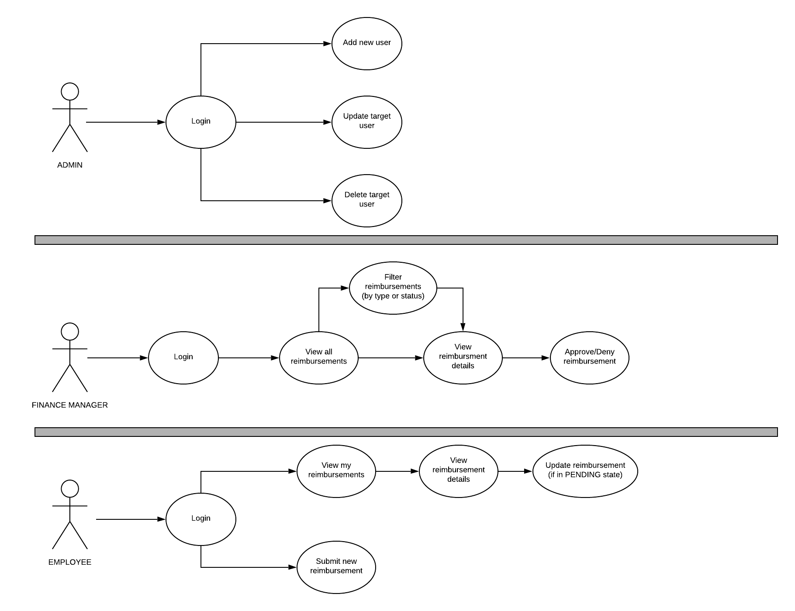

# Employee Reimbursement System Backend

## Introduction

### Developer

- Yuan Cao
- Java React Full Stack Developer at Revature

### Product Overview

- Prototype Backend of an ERS System
- Conforms to RESTful architecture constraints
- Persist relevant data in 3NF

### User Stories

- Employees
	- Need to create tickets
	- Need to check ticket status

- Managers
	- Need to decision about the approve/deny of tickets
	- Need to check all pending tickets
	- (Optional: review past tickets)

- Admin
	- Need to activate/deactivate users

### Why RESTful?

- Adaptability to new demand
	- Client-Server Architecture
	- Uniform Interface and Layered System
	- Code on Demand (optional and not implemented for this project)

- Simple Scalability
	- Stateless
	- Cacheable

### WHY 3NF?

- Ease of use
- Adaptable to new applications
- Relatively small foot print on disk given the information

- Each column is one attribute
- Each row is one fact about the primary key
- No partial dependency
	- Each attribute depends on only a portion of the primary key
- No transitive dependency
	- Each attribute depends on another attribute that is not part of the primary key

### Technology Overview

- Persistent Layer: PostgreSQL

- Application Layer: Java 8

	- Project Management
		- Apache Maven
		- Git
		- IntelliJ IDEA

  - Database Connection
		- JDBC

  - Networking
		- Javalin
		- Jackson
		- JSON Web Tokens

  - Testing
		- JUnit
		- Mockito

  - Logging
		- SLF4J (Simple Logging Facade for Java)

- API/Functional Testing: Postman

## Demo

### Phase 0

- Run ddl script
- Run Unit Tests
- Run dml script

### Phase 1

- Run Postman User Management Requests

### Phase 2

- Run Postman Ticket Management Requests

### Phase 3

- Run advanced tests in Postman
